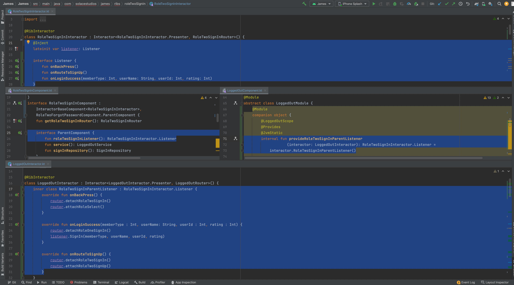
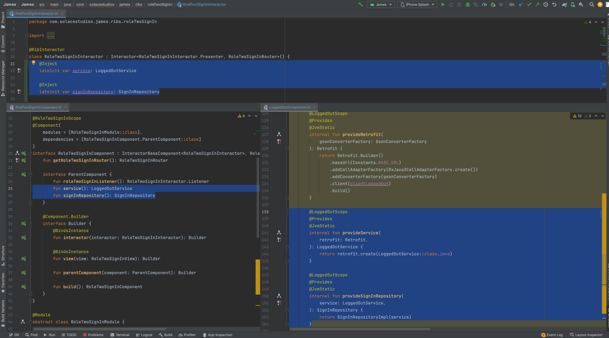

## What Doing?

I'm breaking down the structure of the component file to make it clear how to pass around data from one rib to another. I'll be using Root and Logged In ribs
as an example.

## Imports

Here we go through different things that are being imported across different types of ribs

### Share across all RIBs:
```
import android.view.ViewGroup
import com.uber.rib.core.InteractorBaseComponent
import dagger.*
import java.lang.annotation.Retention
import java.lang.annotation.RetentionPolicy
import javax.inject.Scope
```

- The viewgroup is to be able to display a view to the user
- Interactor Base Component is for having an interactor as part of your rib
- Dagger is dependency injection
- Retention, Retention Policy, and Scope are for annotations involving depedency injection

### RIBs with no children:
```
package com.solacestudios.james.ribs.roleTwoSignUp

import com.solacestudios.james.network.LoggedOutService
import com.solacestudios.james.repository.CaptainSignUpRepository
```
- LoggedOutService includes the network calls for all child ribs of logged out. Used later in parent component
- Captain Sign Up Repository specifically creates an observable as a result of a captain sign up network call which roleTwoSign uses

### RIB with children and parent
```
import com.solacestudios.james.network.LoggedOutService
import com.solacestudios.james.repository.*
import com.solacestudios.james.ribs.roleOneSignIn.RoleOneSignInBuilder
import com.solacestudios.james.ribs.roleOneSignIn.RoleOneSignInComponent
import com.solacestudios.james.ribs.roleOneSignIn.RoleOneSignInInteractor
import com.solacestudios.james.ribs.roleOneSignUp.RoleOneSignUpBuilder
import com.solacestudios.james.ribs.roleOneSignUp.RoleOneSignUpComponent
import com.solacestudios.james.ribs.roleOneSignUp.RoleOneSignUpInteractor
import com.solacestudios.james.ribs.roleSelect.RoleSelectBuilder
import com.solacestudios.james.ribs.roleSelect.RoleSelectComponent
import com.solacestudios.james.ribs.roleSelect.RoleSelectInteractor
import com.solacestudios.james.ribs.roleTwoSignIn.RoleTwoSignInBuilder
import com.solacestudios.james.ribs.roleTwoSignIn.RoleTwoSignInComponent
import com.solacestudios.james.ribs.roleTwoSignIn.RoleTwoSignInInteractor
import com.solacestudios.james.ribs.roleTwoSignUp.RoleTwoSignUpBuilder
import com.solacestudios.james.ribs.roleTwoSignUp.RoleTwoSignUpComponent
import com.solacestudios.james.ribs.roleTwoSignUp.RoleTwoSignUpInteractor
import com.solacestudios.james.util.Constants
import retrofit2.Retrofit
import okhttp3.OkHttpClient
import okhttp3.logging.HttpLoggingInterceptor
import retrofit2.adapter.rxjava3.RxJava3CallAdapterFactory
import retrofit2.converter.gson.GsonConverterFactory
```

- LoggedOutService includes the network calls for all child ribs of logged out. Used to provide LoggedOutService to Children
- Including all repositories allows to provide repositories to children
- Child rib builders are passed to LoggedOutRouter so it can properly build the child ribs
- Child rib interactors are used to provide child ribs with parent implementation of listener
- Child rib components are used to inherit child rib Parent Component in Logged Out. So Logged Out has to implement whatever is in their parent component as
Logged Out is their parent
- Constants file brings base url variable which is used for retrofit
- Retrofit is used for creating instantiating a retrofit instance for LoggedOutService to use as part of the network calls. Retrofit is able to take a model and turn it
into a json request
- okhttp is for creating a client to intercept network request created by retrofit for logging purposes

## Top Level Component Annotations

### Share across all RIBs:
```
@LoggedOutScope
@Component(
    modules = [LoggedOutModule::class],
    dependencies = [LoggedOutComponent.ParentComponent::class]
)
```

- A scope annotation applies to a class containing an injectable constructor and governs how the injector reuses instances of the type.
- Component annotation Annotates an interface or abstract class for which a fully-formed, dependency-injected implementation is to be generated from a set of modules.
- modules A list of classes annotated with Module whose bindings are used to generate the component implementation.
- dependencies A list of types that are to be used as component dependencies. In this case the dependencies defined in logged out components Parent Component.
Root would provide LoggedOut with everything in its parent component

## Component Interface

Component Interface will declare functions for the ribs DI implementation by dagger

### Interface Inheritance w/ Children

```
interface LoggedOutComponent : InteractorBaseComponent<LoggedOutInteractor>,
    RoleSelectComponent.ParentComponent,
    RoleTwoSignUpComponent.ParentComponent,
    RoleOneSignUpComponent.ParentComponent,
    RoleOneSignInComponent.ParentComponent,
    RoleTwoSignInComponent.ParentComponent
```

- The interface will inherit the parent component of it's children. This means if the parent (in this case LoggedOut) doesn't provide everything their children need,
the program will not compile.

### Interface Inheritance w/o Children

```
interface RoleTwoSignUpComponent : InteractorBaseComponent<RoleTwoSignUpInteractor>
```

- The interface will always inherit from InteractorBaseComponent regardless if it has no children

## Builder Functions

### get[RIBName]Router

```
    fun getRoleTwoSignUpRouter(): RoleTwoSignUpRouter
```

- This is returned by the builder's build function

## ParentComponent

### RootRib

```
interface ParentComponent
```

- Will have nothing declared in the ParentComponent interface as it has no parent rib

### Ribs With a Parent

```
    interface ParentComponent {
        fun roleTwoSignInListener(): RoleTwoSignInInteractor.Listener
        fun service(): LoggedOutService
        fun signInRepository(): SignInRepository
    }
```


#### Listener Functionality
- LoggedOut is the parent of roleTwoSignIn. roleTwoSignInListener function inherits from the Listener interface declared in RoleTwoSignInInteractor. This means the
implementation of the functions declared in that Listener interface, will exist in LoggedOut's interactor.

***This is a very important concept so here is what that looks like concretely:***



- On the top, our RoleTwoSignInInteractor declares the functions of RoleTwoSignIn's listener. Also, we declare a listener will be injected for us so we can use
the functions of the listener in the interactor without having the implementation in RoleTwoSignIn

- In the middle on the left, RoleTwoSignIn's Component declares its parent component (LoggedOutComponent) will provide an implementation of RoleTwoSignIn Interactor's
Listener.

- In the middle on the right, LoggedOutComponent does exactly that. It provides for RoleTwoSignIn Interactor's Listener the implementation defined in Logged Out's
RoleTwoSignInParentListener class.

- On the bottom, is the RoleTwoSignInParentListener class defined in LoggedOut interactor defining the Listener interface declared in RoleTwoSignInInteractor

#### Injected variables

***This is a very important concept so here is what that looks like concretely:***



- On the top, our RoleTwoSignInInteractor declares the variables that will be injected for us so we can use these variables in our class without
instantiating them in our interactor (RoleTwoSignInInteractor)
- On the bottom left, RoleTwoSignIn's Component declares its parent component (LoggedOutComponent) will provide an instantiated LoggedOut Service and
SignInRepository
- On the bottom right, that's exactly what LoggedOutComponent does.
    - provideService returns a retrofit object of type LoggedOutService
    - provideSignInRepository returns SignInRepository Implementation passing in LoggedOutService

So our parent is instantiating these variables with data, our child component is declaring it's parent component will provide our child with data, and
our child interactor's is using these variables to do things.

## Builder Interface

### Share across all RIBs:
```
    @Component.Builder
    interface Builder {
        @BindsInstance
        fun interactor(interactor: RoleTwoSignInInteractor): Builder

        @BindsInstance
        fun view(view: RoleTwoSignInView): Builder

        fun parentComponent(component: ParentComponent): Builder

        fun build(): RoleTwoSignInComponent
    }
```
